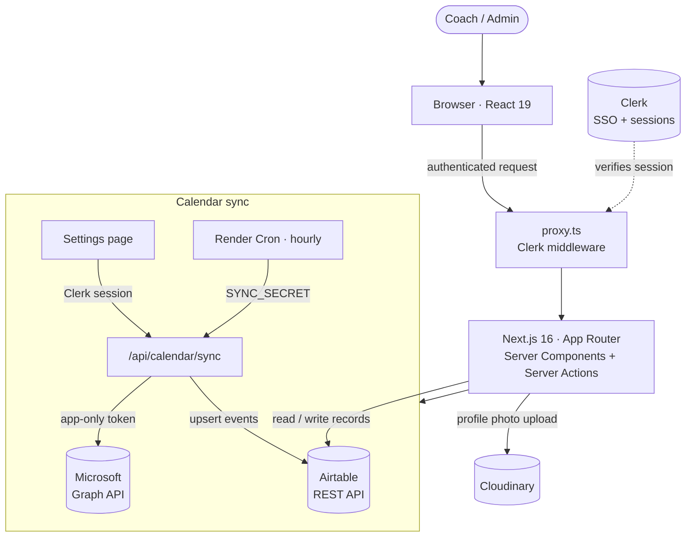
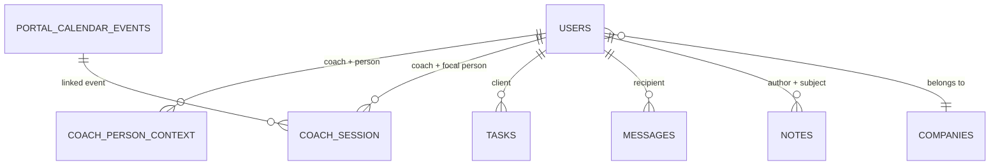
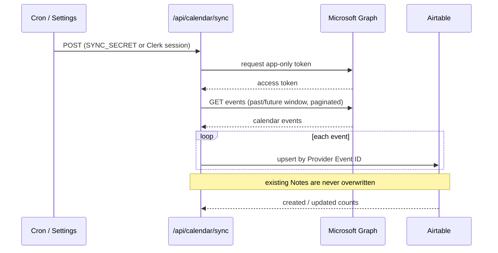

# LeadershipTap Portal

A production internal portal for a leadership-coaching practice. Coaches use it to manage their clients, prepare for and capture notes from coaching sessions, sync their meetings from Microsoft 365, and draft follow-up messages — all backed by an Airtable base the team already used as its system of record.

Built with **Next.js 16 (App Router)**, **Clerk** authentication, **Airtable** as the data layer, and the **Microsoft Graph API** for calendar sync.


---

## Features

- **Client directory & profiles** — searchable, filterable client list with rich profiles (role, company, team, personality assessments, relationship context, and coaching history).
- **Dashboard** — at-a-glance view of upcoming sessions, sessions needing notes, open tasks, recent activity, and the coach's clients.
- **Calendar sync** — pulls coach calendars from Microsoft 365 via Microsoft Graph (app-only auth) and upserts them into Airtable, deduplicating on the provider event ID.
- **Session notes & action items** — capture notes against a specific meeting; notes surface back on the client profile.
- **Handwritten ink notes** — pressure-sensitive freehand note-taking (built on `perfect-freehand`) with an eraser, ink smoothing, and image upload.
- **Follow-up messages** — draft and track follow-up emails per client (Pending / Sent).
- **Tasks** — lightweight action-item tracking linked to clients.
- **Coach / Admin view modes** — coaches see their own clients; admins see everyone, via a sidebar toggle persisted in a cookie.
- **Profile photo uploads** — browser → Cloudinary → Airtable avatar URL.

## Tech stack

| Area | Choice |
|---|---|
| **Framework** | Next.js 16 (App Router, React 19, TypeScript) |
| **Auth** | Clerk (Microsoft 365 / Google SSO) |
| **Calendar** | Microsoft Graph API (app-only / client-credentials flow) |
| **Data** | Airtable REST API (server-side only — the API key never reaches the browser) |
| **UI** | Tailwind CSS + shadcn/ui (Radix primitives), lucide-react icons |
| **Ink** | perfect-freehand |
| **File uploads** | Cloudinary (profile photos) |
| **Hosting** | Vercel (web app) + Render Cron (hourly calendar sync) |

## Prerequisites

- Node.js 18+
- A [Clerk](https://clerk.com) account with an application created
- An [Airtable](https://airtable.com) base matching the schema below and a Personal Access Token
- An Azure app registration with `Calendars.Read` (application permission) granted

## Getting started

### 1. Clone and install

```bash
git clone https://github.com/gabrielasie/leadershiptap-portal.git
cd leadershiptap-portal
npm install
```

### 2. Environment variables

Create `.env.local`:

```env
# Airtable
AIRTABLE_API_KEY=pat...           # Personal Access Token (starts with "pat")
AIRTABLE_BASE_ID=app...           # Base ID from the Airtable URL

# Clerk
NEXT_PUBLIC_CLERK_PUBLISHABLE_KEY=pk_test_...
CLERK_SECRET_KEY=sk_test_...
NEXT_PUBLIC_CLERK_SIGN_IN_URL=/sign-in
NEXT_PUBLIC_CLERK_SIGN_UP_URL=/sign-up
NEXT_PUBLIC_CLERK_AFTER_SIGN_IN_URL=/dashboard
NEXT_PUBLIC_CLERK_AFTER_SIGN_UP_URL=/dashboard

# Microsoft Graph (calendar sync only)
AZURE_TENANT_ID=...               # Azure AD tenant ID
AZURE_CLIENT_ID=...               # App registration client ID
AZURE_CLIENT_SECRET=...           # App registration client secret

# Cloudinary (profile photo uploads)
NEXT_PUBLIC_CLOUDINARY_CLOUD_NAME=...
CLOUDINARY_UPLOAD_PRESET=...

# Calendar sync (optional)
SYNC_SECRET=...                   # Shared secret for cron-triggered syncs
```

### 3. Run the dev server

```bash
npm run dev
```

Open [http://localhost:3000](http://localhost:3000). You will be redirected to `/sign-in`.

---

## Architecture



> The browser never touches Airtable, Graph, or Cloudinary secrets — every external call is made server-side from route handlers and server actions.

### Airtable tables

| Table | Purpose |
|---|---|
| **Users** | All people — coaches, admins, clients. The `Role` field distinguishes them. |
| **Portal Calendar Events** | Active calendar table. Synced from Microsoft Graph via `/api/calendar/sync`. Fields: Subject, Start, End, Provider Event ID, Participant Emails, Notes, Note Name. |
| **Coach-Person Context** | Per coach ↔ client pair: Quick Notes, Family Details. One record per pair. |
| **Coach Session** | Per coach ↔ meeting pair: Session Notes, Action Items. One record per meeting per coach. |
| **Messages** | Follow-up email drafts. Status: `"Pending"` or `"Sent"` (never `"Draft"`). |
| **Tasks** | Portal action items linked to clients. |
| **Notes** | Free-form coaching notes not tied to a specific meeting. |
| **Companies** | Company records linked from Users. |
| **Personality lookups** | Enneagram / 16Personalities / Conflict Postures / Apology Languages / Strengths. |

> An older **Calendar Events** table exists as an archived, read-only snapshot and is never queried by the portal — all calendar reads/writes go through **Portal Calendar Events**.

Core relationships (simplified):



### Auth layers

Two separate auth systems that never interact:

**Clerk** — app login. Every browser session is authenticated via Clerk. `getCurrentUserRecord()` resolves the Clerk session to an Airtable Users record by email. The access role (`admin` / `coach`) comes from Clerk `publicMetadata.role` as the source of truth.

**Microsoft Graph** — calendar data only. Uses the client-credentials (app-only) flow, so no user login is required. Called exclusively from the `/api/calendar/sync` route handler. The access token is never stored; it is fetched fresh on each sync.

### Note model

Notes live in different places depending on scope, and are read most-specific-first:

| Scope | Table | When to use |
|---|---|---|
| General client facts | **Users** record | Persistent profile fields (name, birthday, etc.) |
| Coach ↔ client context | **Coach-Person Context** | Quick Notes, Family Details — per coach/person pair |
| Session notes | **Coach Session** | Notes captured during or after a specific meeting |

**Reading order** (most specific wins): Coach Session → Coach-Person Context → User record.

Quick Notes and Family Details are written to Coach-Person Context, never to the User record directly (`upsertCoachPersonContext()` is the only write path). Session Notes are written to Coach Session via `upsertCoachSession()`.

### View modes

Coaches can toggle between **Coach View** (their own clients only) and **Admin View** (all clients) from the sidebar.

- The current mode is stored in the `lt_view_mode` cookie (readable server-side).
- `ViewModeProvider` (client) keeps the cookie and `localStorage` in sync and exposes `useViewMode()`.
- Server components read the cookie directly via `next/headers` to filter data before rendering.
- `getUsers(sessionUser, filterByCoachId?)` applies the filter — when set, only users whose `coachIds` include that ID are returned.

### Calendar sync

`POST /api/calendar/sync` fetches events for each coach's calendar from Microsoft Graph over a configurable window (past/future days), then upserts them into **Portal Calendar Events** using `Provider Event ID` as the stable identity key. Existing `Notes` are never overwritten — only coaches write to that field.

The sync can be triggered two ways:
- **From the Settings page** (authenticated via the Clerk session), or
- **By an hourly cron** — `render.yaml` defines a Render Cron job (`scripts/sync-calendar.mjs`) that calls the endpoint with a `SYNC_SECRET` header.



---

## Project structure

```
app/
├── (protected)/              # All authenticated routes
│   ├── layout.tsx            # ViewModeProvider + auth gate
│   ├── dashboard/            # Main dashboard (regions: sessions, tasks, clients)
│   ├── users/                # Client directory
│   │   └── [id]/             # Client profile, sessions, notes, messages
│   ├── meetings/[id]/        # Meeting detail
│   ├── sessions/             # Session notes
│   └── settings/             # Calendar sync + account
├── api/
│   ├── calendar/sync/        # Microsoft Graph → Airtable upsert
│   ├── upload-photo/         # Cloudinary → Airtable avatar
│   └── ...                   # notes, people, users, permissions
├── context/                  # ViewMode context (Coach/Admin toggle)
└── actions/                  # Server actions (e.g. set view-mode cookie)

lib/
├── airtable/                 # Low-level Airtable fetch functions (no SDK)
├── graph/                    # Microsoft Graph helpers (auth + calendar)
├── services/                 # Business logic over lib/airtable/*
└── auth/                     # Clerk → Airtable resolution + authorization

components/                   # Shared UI (shadcn/ui primitives, layout, ink, notes)
scripts/                      # One-off maintenance/migration scripts (tsx / node)
```

## Deployment

The Next.js app deploys to **Vercel** on every push to `main`. An hourly **Render Cron** job (`render.yaml`) triggers calendar sync. Add every `.env.local` variable to the corresponding host's environment settings.

---

## License

Proprietary. This repository is shared publicly for portfolio and code-review purposes; it is not licensed for reuse.
